::::::::: {.page-bg}

::: {.hero-section}
### OWO/OSE FEDERAL CONSTITUENCY
# ODA – The Alternative for Change
### A Vision Built on Opportunities, Development and Accountability

For over **15 years**, Oluwadamilola Desmond Awoyo has served the people of Owo/Ose through community development, philanthropy and public service.

Join us as we build a future where every citizen has the opportunity to thrive.

<a href="join.qmd" class="btn-primary-custom">Join the Movement</a>
<a href="mission.qmd" class="btn-outline-light ms-3">Our Mission</a>
:::

:::::: {.section-block}
## Our Impact So Far

:::: {.columns}

::: {.column width="25%"}
<div onclick="document.getElementById('modalYears').style.display='flex'" style="cursor:pointer;">
# 15+
Years of Service
</div>
:::

::: {.column width="25%"}
<div onclick="document.getElementById('modalLives').style.display='flex'" style="cursor:pointer;">
# 5,000+
Lives Reached
</div>
:::

::: {.column width="25%"}
<div onclick="document.getElementById('modalCommunities').style.display='flex'" style="cursor:pointer;">
# 25+
Communities
</div>
:::

::: {.column width="25%"}
<div onclick="document.getElementById('modalSupport').style.display='flex'" style="cursor:pointer;">
# ₦50M+
Community Support
</div>
:::

::::
::::::

::::: {.section-block}

:::: {.columns}

::: {.column width="45%"}
{style="width:100%; border-radius:16px;"}
:::

::: {.column width="55%"}
## Meet Oluwadamilola Desmond Awoyo

For over **15 years**, Oluwadamilola Desmond Awoyo has devoted his life to public service, community development, youth empowerment and philanthropy throughout Owo/Ose.

His campaign is built on a simple belief:

**Leadership should create opportunities, drive development, and remain accountable to the people.**

Rather than making promises, ODA believes in building trust through visible action and measurable impact.

<a href="leadership.qmd" class="btn-primary-custom">Learn More</a>
:::

::::
:::::

::::::: {.section-block}
## Our Commitments

:::::: {.columns}

::::: {.column width="33%"}
:::: {.card-custom}
<div onclick="document.getElementById('modalEducation').style.display='flex'" style="cursor:pointer;">
# 🎓
### Education & Youth
Scholarships, skills acquisition, entrepreneurship support and opportunities for young people across Owo/Ose.
</div>
::::
:::::

::::: {.column width="33%"}
:::: {.card-custom}
<div onclick="document.getElementById('modalHealthcare').style.display='flex'" style="cursor:pointer;">
# 🏥
### Healthcare & Development
A strong constituency is built on strong infrastructure. ODA is committed to improving access to quality healthcare and development.
</div>
::::
:::::

::::: {.column width="33%"}
:::: {.card-custom}
<div onclick="document.getElementById('modalLeadership').style.display='flex'" style="cursor:pointer;">
# 🤝
### Transparent Leadership
Leadership only means something when it's accountable — regularly reporting back to constituents and listening to community concerns.
</div>
::::
:::::

::::::
:::::::

::: {.section-dark}

# Latest News

Stay informed about campaign activities, community outreach, and upcoming events.

<a href="news.qmd" class="btn-gold">Read Latest Updates</a>

:::

:::: {.section-block}

# Community in Action

```{=html}
<div id="communityCarousel" class="carousel slide gallery-carousel" data-bs-ride="carousel">
  <div class="carousel-inner">
    <div class="carousel-item active">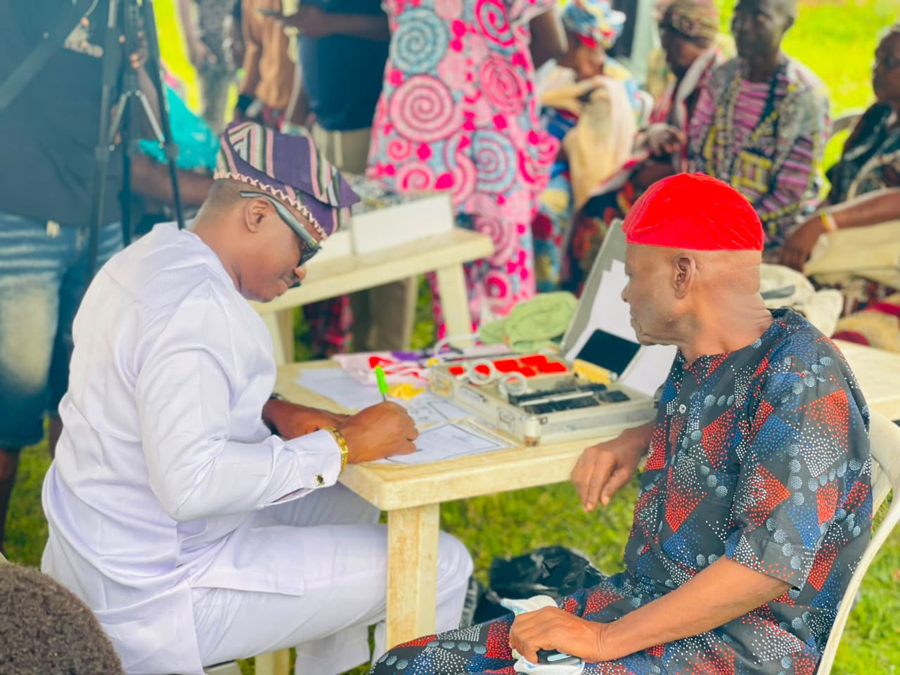</div>
    <div class="carousel-item">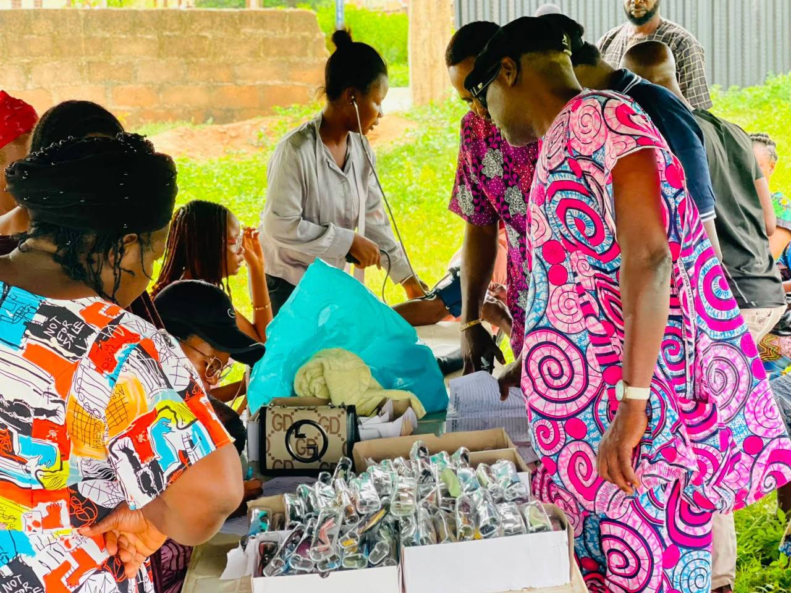</div>
    <div class="carousel-item">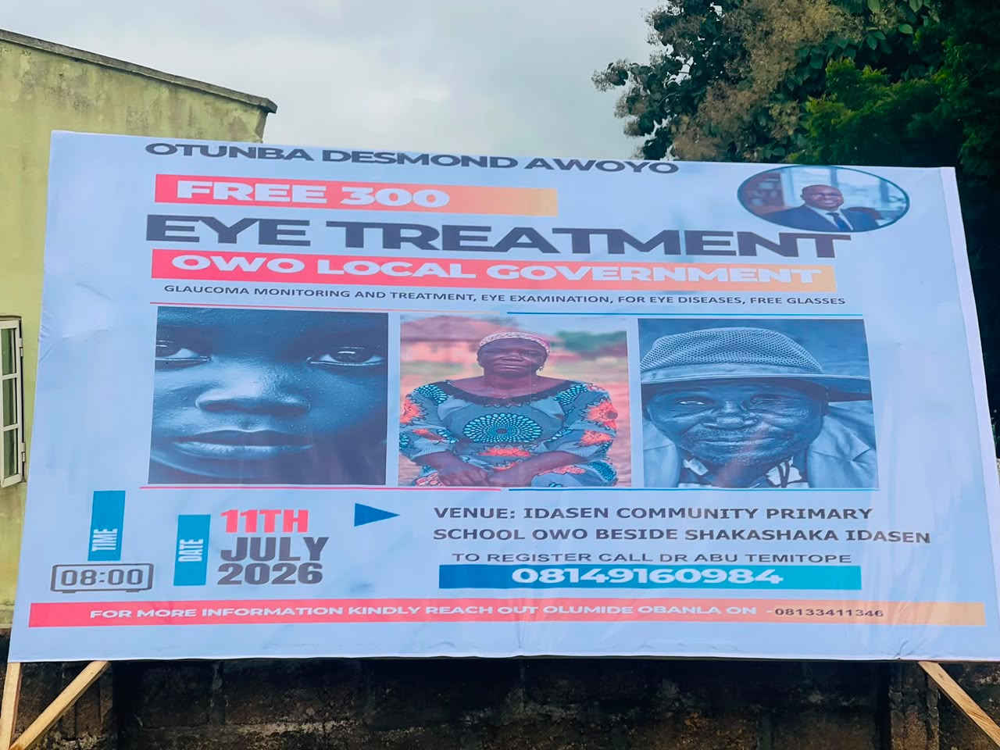</div>
    <div class="carousel-item"></div>
    <div class="carousel-item"></div>
    <div class="carousel-item">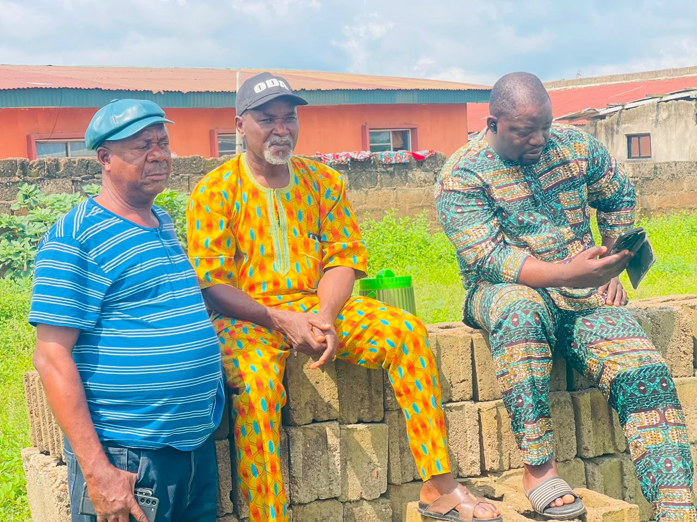</div>
    <div class="carousel-item"></div>
    <div class="carousel-item">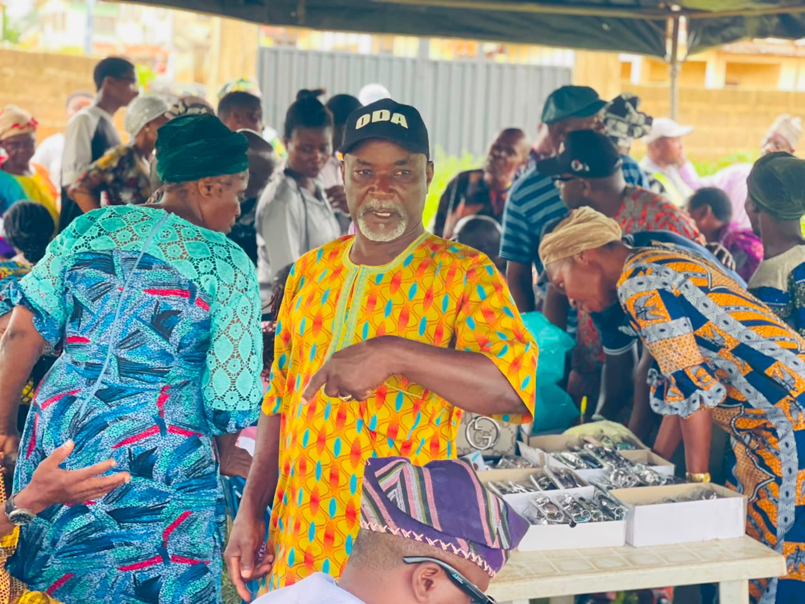</div>
    <div class="carousel-item">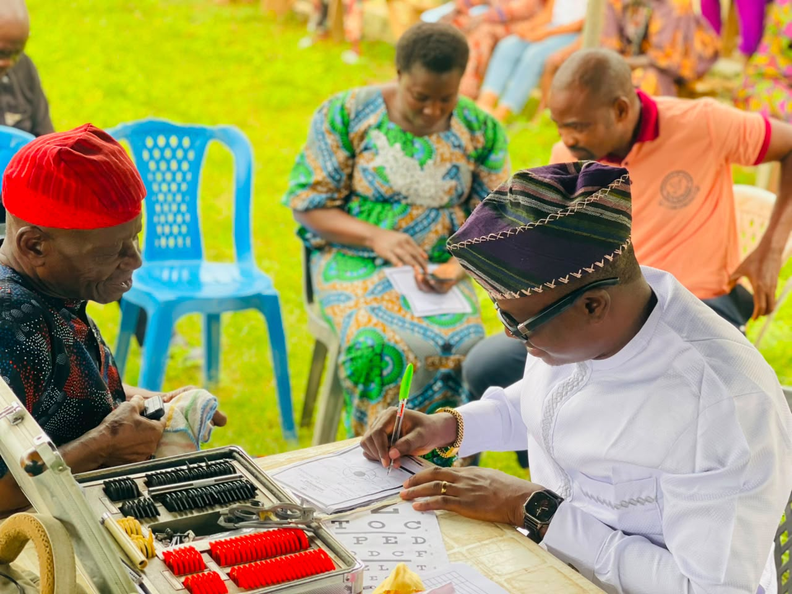</div>
    <div class="carousel-item">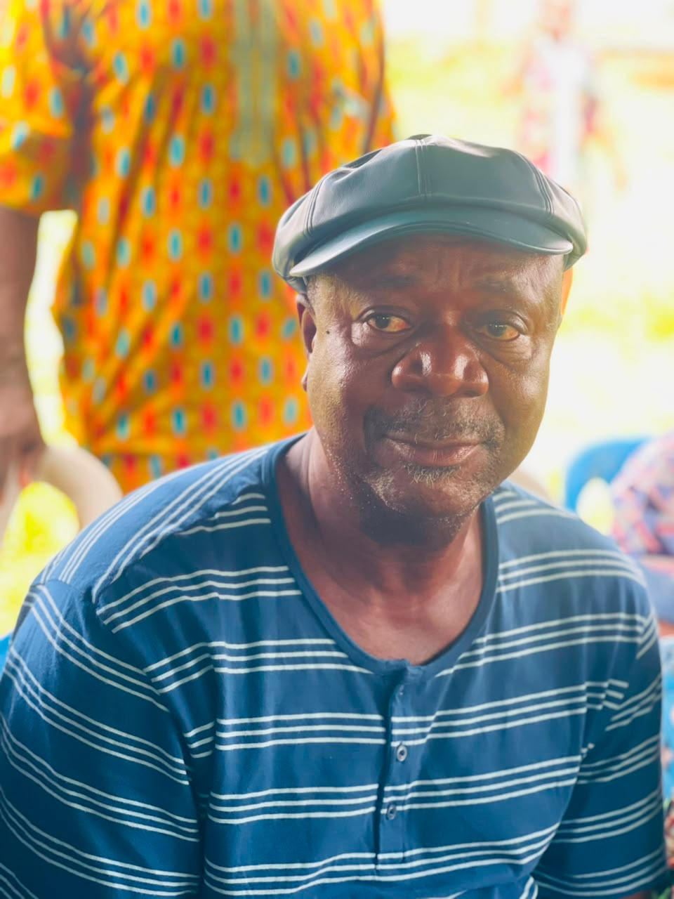</div>
    <div class="carousel-item">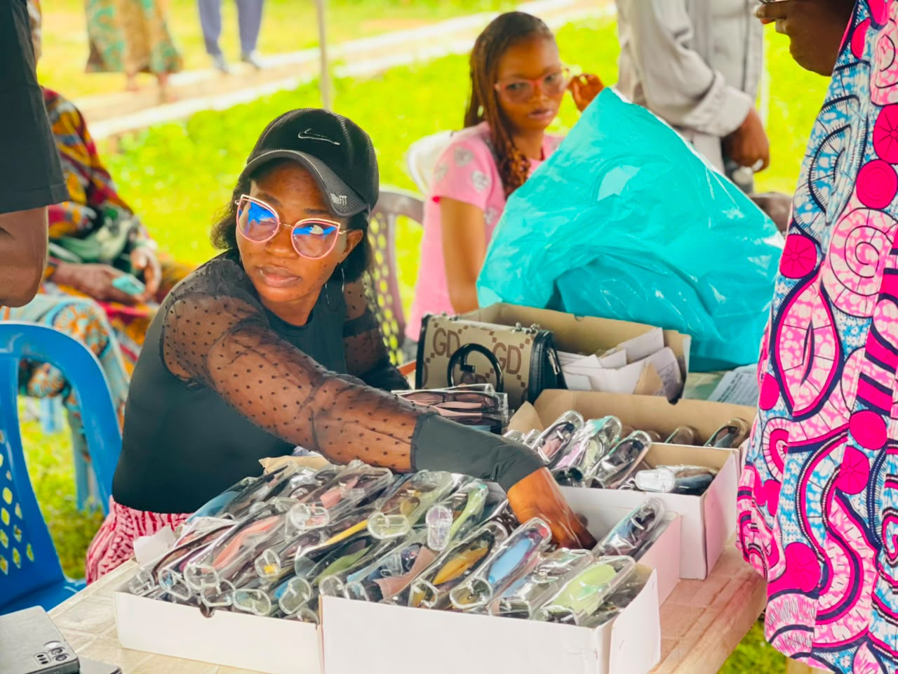</div>
    <div class="carousel-item">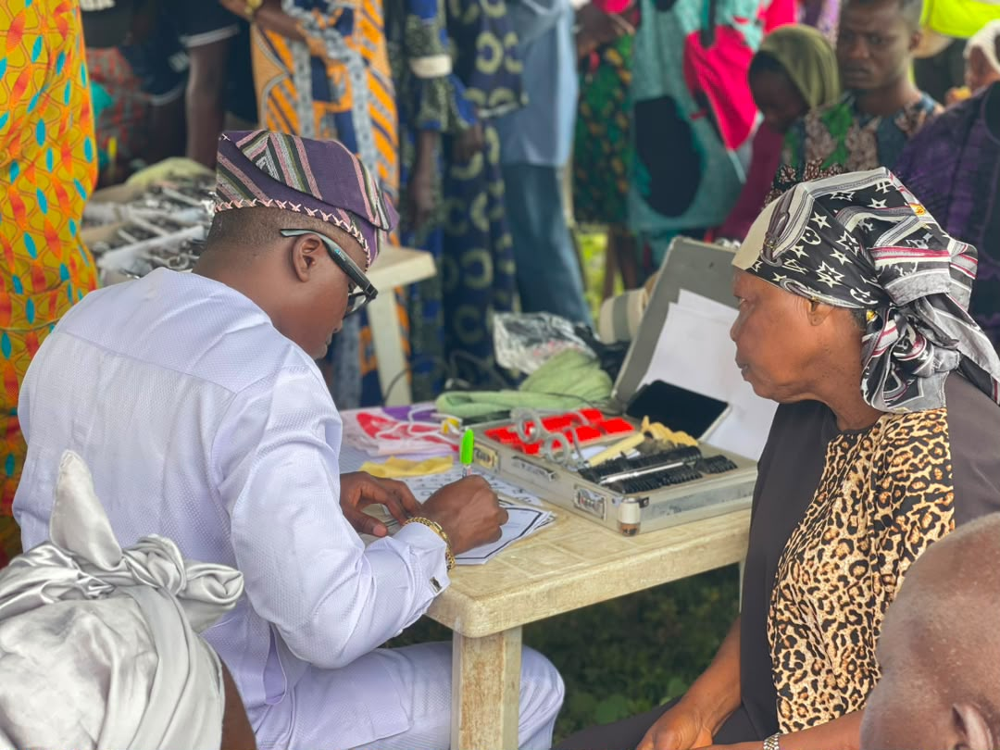</div>
    <div class="carousel-item">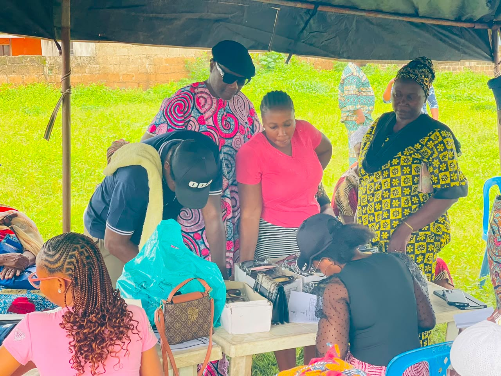</div>
    <div class="carousel-item">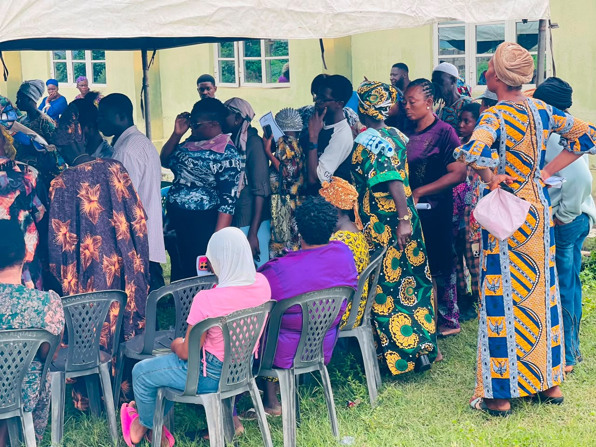</div>
    <div class="carousel-item">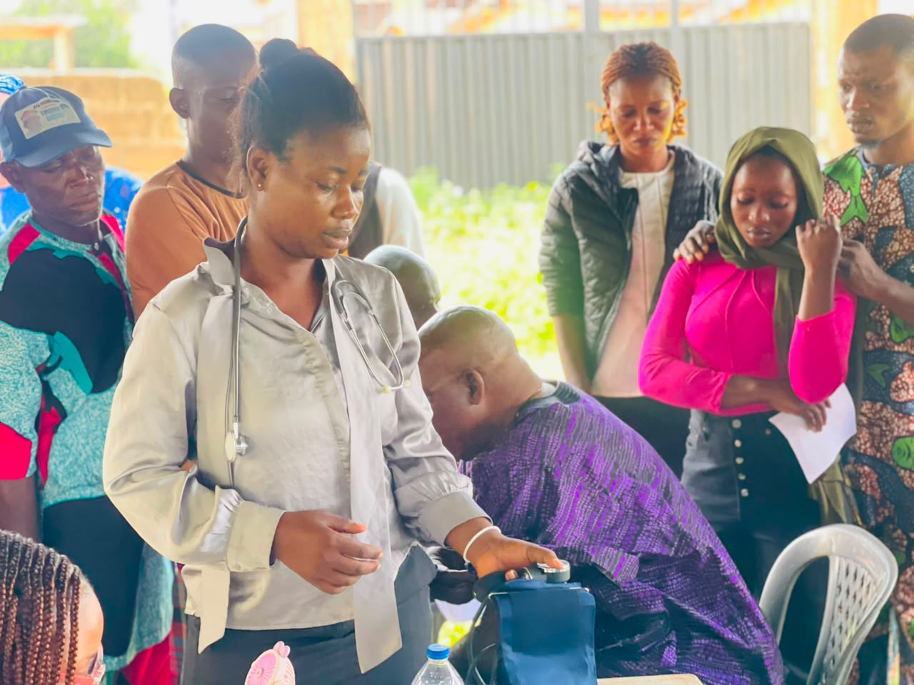</div>
  </div>
  <button class="carousel-control-prev" type="button" data-bs-target="#communityCarousel" data-bs-slide="prev">
    <span class="carousel-control-prev-icon"></span>
  </button>
  <button class="carousel-control-next" type="button" data-bs-target="#communityCarousel" data-bs-slide="next">
    <span class="carousel-control-next-icon"></span>
  </button>
</div>
```

::::

:::: {.section-block}

# Education Programs

```{=html}
<div id="educationCarousel" class="carousel slide gallery-carousel" data-bs-ride="carousel">
  <div class="carousel-inner">
    <div class="carousel-item active"></div>
    <div class="carousel-item"></div>
    <div class="carousel-item">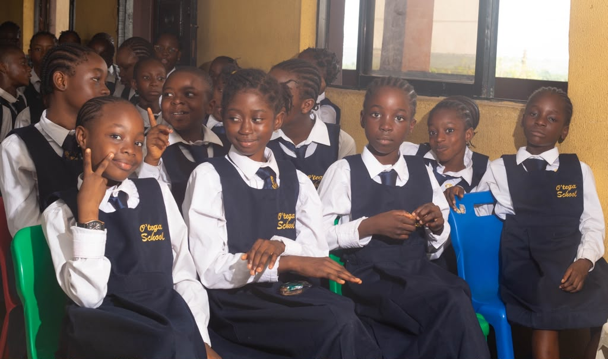</div>
    <div class="carousel-item"></div>
    <div class="carousel-item"></div>
    <div class="carousel-item">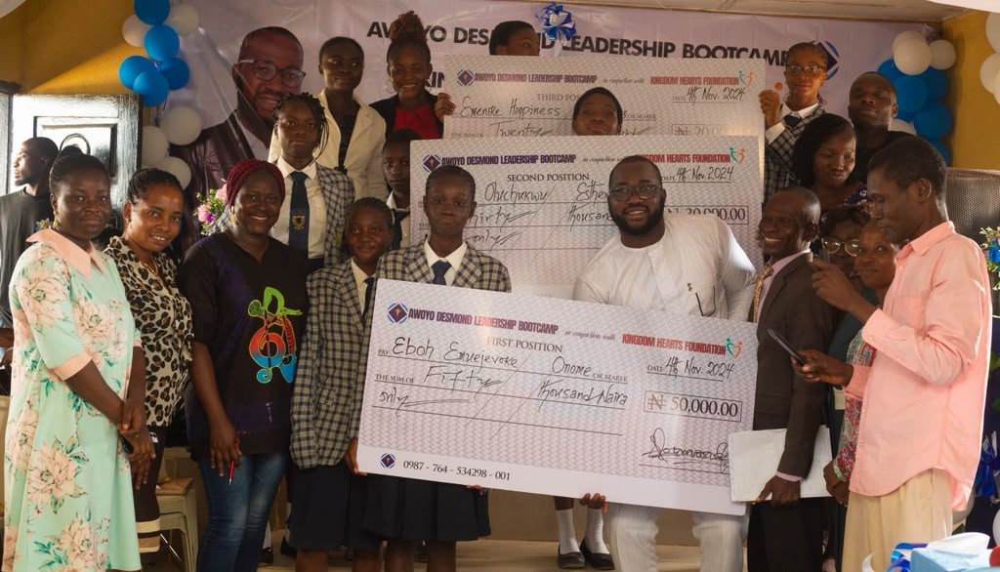</div>
    <div class="carousel-item"></div>
    <div class="carousel-item"></div>
    <div class="carousel-item"></div>
    <div class="carousel-item"></div>
    <div class="carousel-item"></div>
    <div class="carousel-item"></div>
    <div class="carousel-item"></div>
    <div class="carousel-item"></div>
    <div class="carousel-item"></div>
    <div class="carousel-item"></div>
    <div class="carousel-item"></div>
  </div>
  <button class="carousel-control-prev" type="button" data-bs-target="#educationCarousel" data-bs-slide="prev">
    <span class="carousel-control-prev-icon"></span>
  </button>
  <button class="carousel-control-next" type="button" data-bs-target="#educationCarousel" data-bs-slide="next">
    <span class="carousel-control-next-icon"></span>
  </button>
</div>
```

::::

::: {.section-dark}

# Stay Connected

Receive campaign news, community updates and important announcements.

```{=html}
<style>
  @font-face {
    font-display: block;
    font-family: Roboto;
    src: url(https://assets.brevo.com/font/Roboto/Latin/normal/normal/7529907e9eaf8ebb5220c5f9850e3811.woff2) format("woff2"), url(https://assets.brevo.com/font/Roboto/Latin/normal/normal/25c678feafdc175a70922a116c9be3e7.woff) format("woff")
  }

  @font-face {
    font-display: fallback;
    font-family: Roboto;
    font-weight: 600;
    src: url(https://assets.brevo.com/font/Roboto/Latin/medium/normal/6e9caeeafb1f3491be3e32744bc30440.woff2) format("woff2"), url(https://assets.brevo.com/font/Roboto/Latin/medium/normal/71501f0d8d5aa95960f6475d5487d4c2.woff) format("woff")
  }

  @font-face {
    font-display: fallback;
    font-family: Roboto;
    font-weight: 700;
    src: url(https://assets.brevo.com/font/Roboto/Latin/bold/normal/3ef7cf158f310cf752d5ad08cd0e7e60.woff2) format("woff2"), url(https://assets.brevo.com/font/Roboto/Latin/bold/normal/ece3a1d82f18b60bcce0211725c476aa.woff) format("woff")
  }

  :where(.sib-form-message-panel) {
    display: none;
  }

  :where(.sib-form-message-panel .sib-notification__icon) {
    width: 20px;
    height: 20px;
  }

  #sib-container input:-ms-input-placeholder {
    font-family: Helvetica, sans-serif;
    text-align: left;
    color: #c0ccda;
  }

  #sib-container input::placeholder {
    font-family: Helvetica, sans-serif;
    text-align: left;
    color: #c0ccda;
  }

  #sib-container textarea::placeholder {
    font-family: Helvetica, sans-serif;
    text-align: left;
    color: #c0ccda;
  }

  #sib-container a {
    text-decoration: underline;
    color: #2BB2FC;
  }
</style>
<link rel="stylesheet" href="https://sibforms.com/forms/end-form/build/sib-styles.css">

<div class="sib-form">
  <div class="sib-form" style="text-align: center; background-color: #EFF2F7;">
    <div id="sib-form-container" class="sib-form-container">
      <div id="error-message" class="sib-form-message-panel" style="font-family:Helvetica, sans-serif; font-size:16px; text-align:left; color:#661d1d; background-color:#ffeded; border-color:#ff4949; border-radius:3px; max-width:540px;">
        <div class="sib-form-message-panel__text sib-form-message-panel__text--center">
          <svg viewBox="0 0 512 512" class="sib-icon sib-notification__icon">
            <path d="M256 40c118.621 0 216 96.075 216 216 0 119.291-96.61 216-216 216-119.244 0-216-96.562-216-216 0-119.203 96.602-216 216-216m0-32C119.043 8 8 119.083 8 256c0 136.997 111.043 248 248 248s248-111.003 248-248C504 119.083 392.957 8 256 8zm-11.49 120h22.979c6.823 0 12.274 5.682 11.99 12.5l-7 168c-.268 6.428-5.556 11.5-11.99 11.5h-8.979c-6.433 0-11.722-5.073-11.99-11.5l-7-168c-.283-6.818 5.167-12.5 11.99-12.5zM256 340c-15.464 0-28 12.536-28 28s12.536 28 28 28 28-12.536 28-28-12.536-28-28-28z" />
          </svg>
          <span class="sib-form-message-panel__inner-text">Your subscription could not be saved. Please try again.</span>
        </div>
      </div>
      <div></div>
      <div id="success-message" class="sib-form-message-panel" style="font-family:Helvetica, sans-serif; font-size:16px; text-align:left; color:#085229; background-color:#e7faf0; border-color:#13ce66; border-radius:3px; max-width:540px;">
        <div class="sib-form-message-panel__text sib-form-message-panel__text--center">
          <svg viewBox="0 0 512 512" class="sib-icon sib-notification__icon">
            <path d="M256 8C119.033 8 8 119.033 8 256s111.033 248 248 248 248-111.033 248-248S392.967 8 256 8zm0 464c-118.664 0-216-96.055-216-216 0-118.663 96.055-216 216-216 118.664 0 216 96.055 216 216 0 118.663-96.055 216-216 216zm141.63-274.961L217.15 376.071c-4.705 4.667-12.303 4.637-16.97-.068l-85.878-86.572c-4.667-4.705-4.637-12.303.068-16.97l8.52-8.451c4.705-4.667 12.303-4.637 16.97.068l68.976 69.533 163.441-162.13c4.705-4.667 12.303-4.637 16.97.068l8.451 8.52c4.668 4.705 4.637 12.303-.068 16.97z" />
          </svg>
          <span class="sib-form-message-panel__inner-text">You have successfully subscribed to ODA's newsletter. We'll keep you updated with campaign news, events and community programs.</span>
        </div>
      </div>
      <div></div>
      <div id="sib-container" class="sib-container--large sib-container--vertical" style="max-width:540px; text-align:center; background-color:rgba(255,255,255,1); border-width:1px; border-style:solid; border-color:#C0CCD9; border-radius:3px; direction:ltr">
        <form id="sib-form" method="POST" action="https://2828b8f1.sibforms.com/serve/MUIFALoGgFFOUxiBWEzoKwfHeV_5KroUdQw1ktC-kFfia5en72hE303A3dFATxgD_jebv-4YGxJ8DKzrRJ6v77I61pWxQGTnUCdLusRk3VDnPyCzJbU_XlmpLIz31lT8aTRY-P5wPVN5_vYsk8REoN0Kbtblwy-QW1sIDz7Yn8AsyQmrAqQo_I99rBISvY9wjStqcwQyHZoZkIlNWg==" data-type="subscription">
          <div style="padding: 8px 0;">
            <div class="sib-form-block" style="font-family:Comic Sans MS, sans-serif; font-size:32px; font-weight:700; text-align:left; color:#3C4858; background-color:transparent;">
              <p>Newsletter</p>
            </div>
          </div>

          <div style="padding: 8px 0;">
            <div class="sib-form-block" style="font-family:Helvetica, sans-serif; font-size:16px; font-weight:700; font-style:italic; text-align:left; color:#2358ca; background-color:transparent;">
              <div class="sib-text-form-block">
                <p>Subscribe to our newsletter and stay updated.</p>
              </div>
            </div>
          </div>

          <div style="padding: 8px 0;">
            <div class="sib-input sib-form-block">
              <div class="form__entry entry_block">
                <div class="form__label-row">
                  <label class="entry__label" style="font-weight: 700; text-align: left; font-family:Helvetica, sans-serif; font-size:16px; color:#3c4858;" for="EMAIL" data-required="*">Enter your email address to subscribe</label>
                  <div class="entry__field">
                    <input class="input" type="text" id="EMAIL" name="EMAIL" autocomplete="off" value="" placeholder="you@example.com" data-required="true" required />
                  </div>
                </div>
                <label class="entry__error entry__error--primary" style="font-family:Helvetica, sans-serif; font-size:16px; text-align:left; color:#661d1d; background-color:#ffeded; border-color:#ff4949; border-radius:3px;"></label>
                <label class="entry__specification" style="font-family:Helvetica, sans-serif; font-size:12px; text-align:left; color:#8390A4;">Provide your email address to subscribe. For e.g abc@xyz.com</label>
              </div>
            </div>
          </div>

          <div style="padding: 8px 0;">
            <div class="sib-form-block" style="text-align: left">
              <button class="sib-form-block__button sib-form-block__button-with-loader" style="font-family:Helvetica, sans-serif; font-size:16px; font-weight:700; text-align:left; color:#FFFFFF; background-color:#3E4857; border-width:0px; border-radius:3px;" form="sib-form" type="submit">
                <svg class="icon clickable__icon progress-indicator__icon sib-hide-loader-icon" viewBox="0 0 512 512">
                  <path d="M460.116 373.846l-20.823-12.022c-5.541-3.199-7.54-10.159-4.663-15.874 30.137-59.886 28.343-131.652-5.386-189.946-33.641-58.394-94.896-95.833-161.827-99.676C261.028 55.961 256 50.751 256 44.352V20.309c0-6.904 5.808-12.337 12.703-11.982 83.556 4.306 160.163 50.864 202.11 123.677 42.063 72.696 44.079 162.316 6.031 236.832-3.14 6.148-10.75 8.461-16.728 5.01z" />
                </svg>
                SUBSCRIBE
              </button>
            </div>
          </div>

          <input type="text" name="email_address_check" value="" class="input--hidden">
          <input type="hidden" name="locale" value="en">
        </form>
      </div>
    </div>
  </div>
</div>

<script>
  window.REQUIRED_CODE_ERROR_MESSAGE = 'Please choose a country code';
  window.LOCALE = 'en';
  window.EMAIL_INVALID_MESSAGE = window.SMS_INVALID_MESSAGE = "The information provided is invalid. Please review the field format and try again.";
  window.REQUIRED_ERROR_MESSAGE = "This field cannot be left blank. ";
  window.GENERIC_INVALID_MESSAGE = "The information provided is invalid. Please review the field format and try again.";
  window.INVALID_NUMBER = "The information provided is invalid. Please review the field format and try again.";
  window.INVALID_DATE = "Please enter a valid date";
  window.REQUIRED_MULTISELECT_MESSAGE = 'Please select at least 1 option';
  window.translation = {
    common: {
      selectedList: '{quantity} list selected',
      selectedLists: '{quantity} lists selected',
      selectedOption: '{quantity} selected',
      selectedOptions: '{quantity} selected',
    }
  };
  var AUTOHIDE = Boolean(0);
</script>
<script defer src="https://sibforms.com/forms/end-form/build/main.js"></script>
```

:::

```{=html}
<style>
.custom-modal {
  display: none;
  position: fixed;
  top: 0; left: 0;
  width: 100%; height: 100%;
  background: rgba(0,0,0,0.6);
  z-index: 9999;
  align-items: center;
  justify-content: center;
}
.custom-modal-box {
  background: white;
  max-width: 500px;
  width: 90%;
  border-radius: 12px;
  padding: 1.5rem;
  position: relative;
  max-height: 85vh;
  overflow-y: auto;
}
.custom-modal-close {
  position: absolute;
  top: 10px;
  right: 15px;
  font-size: 1.8rem;
  cursor: pointer;
  color: #333;
  background: none;
  border: none;
  line-height: 1;
}
.custom-modal-box img {
  width: 100%;
  border-radius: 10px;
  margin-bottom: 1rem;
}
</style>

<div class="custom-modal" id="modalYears" onclick="if(event.target===this) this.style.display='none'">
  <div class="custom-modal-box">
    <button class="custom-modal-close" onclick="document.getElementById('modalYears').style.display='none'">&times;</button>
    <h5>15+ Years of Service</h5>
    
    <p>For over 15 years, Oluwadamilola Desmond Awoyo has been actively involved in community development across Owo/Ose — from grassroots outreach to youth mentorship programs, building trust one community at a time.</p>
  </div>
</div>

<div class="custom-modal" id="modalLives" onclick="if(event.target===this) this.style.display='none'">
  <div class="custom-modal-box">
    <button class="custom-modal-close" onclick="document.getElementById('modalLives').style.display='none'">&times;</button>
    <h5>5,000+ Lives Reached</h5>
    
    <p>Through scholarship programs, healthcare outreach, and community empowerment initiatives, over 5,000 individuals across Owo/Ose have directly benefited from ODA's ongoing efforts.</p>
  </div>
</div>

<div class="custom-modal" id="modalCommunities" onclick="if(event.target===this) this.style.display='none'">
  <div class="custom-modal-box">
    <button class="custom-modal-close" onclick="document.getElementById('modalCommunities').style.display='none'">&times;</button>
    <h5>25+ Communities</h5>
    
    <p>Development projects and community programs have reached over 25 towns and communities throughout Owo/Ose Federal Constituency.</p>
  </div>
</div>

<div class="custom-modal" id="modalSupport" onclick="if(event.target===this) this.style.display='none'">
  <div class="custom-modal-box">
    <button class="custom-modal-close" onclick="document.getElementById('modalSupport').style.display='none'">&times;</button>
    <h5>₦50M+ Community Support</h5>
    
    <p>Over ₦50 million has been invested directly into community projects, scholarships, healthcare support, and infrastructure improvements.</p>
  </div>
</div>

<div class="custom-modal" id="modalEducation" onclick="if(event.target===this) this.style.display='none'">
  <div class="custom-modal-box">
    <button class="custom-modal-close" onclick="document.getElementById('modalEducation').style.display='none'">&times;</button>
    <h5>Education & Youth</h5>
    
    <p>ODA is committed to expanding scholarship opportunities, funding skills acquisition programs, and supporting youth entrepreneurship across Owo/Ose.</p>
  </div>
</div>

<div class="custom-modal" id="modalHealthcare" onclick="if(event.target===this) this.style.display='none'">
  <div class="custom-modal-box">
    <button class="custom-modal-close" onclick="document.getElementById('modalHealthcare').style.display='none'">&times;</button>
    <h5>Healthcare & Development</h5>
    
    <p>A strong constituency is built on strong infrastructure. ODA is committed to improving access to quality healthcare through equipped clinics and regular medical outreach, upgrading roads to connect communities, ensuring reliable clean water supply, and renovating schools so every child has a safe place to learn.</p>
  </div>
</div>

<div class="custom-modal" id="modalLeadership" onclick="if(event.target===this) this.style.display='none'">
  <div class="custom-modal-box">
    <button class="custom-modal-close" onclick="document.getElementById('modalLeadership').style.display='none'">&times;</button>
    <h5>Transparent Leadership</h5>
    
    <p>Leadership only means something when it's accountable. ODA is committed to open, honest representation — regularly reporting back to constituents, listening to community concerns, and making decisions that reflect the people's priorities, not just the party's.</p>
  </div>
</div>

<script>
window.addEventListener('scroll', function() {
  const navbar = document.querySelector('.navbar');
  if (window.scrollY > 60) {
    navbar.classList.add('navbar-scrolled');
  } else {
    navbar.classList.remove('navbar-scrolled');
  }
});
</script>
```

:::::::::